+++
title = "Connector database"
linkTitle = "Connectors"
weight = 13
+++

Below, a database that will hopefully build up into a useful list of connectors.
Note that links here are not endorsements, but samples where you might be able
to buy, or find more information in order to help you find the right part at
your favourite local dealer.

There's also a handy list of potentially-printable connectors
[here](Connector-Accessories), along with some accessories (eg caps, shells).

## Connectors

### 2-pin

| Description                                | Sample                                                                                                                                                                                 |
| ------------------------------------------ | -------------------------------------------------------------------------------------------------------------------------------------------------------------------------------------- |
| 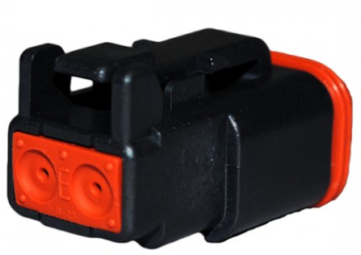           | Part Number: Deutsch/Durite 001142 Typical usage: steering valves on Case/NH https://webshop.durite.co.uk/itm/Deutsch-Connectors/2-Way-Female-Deutsch-DT-Series-Connector/001142 |
|           | Part Number: Delphi 12162193 Typical usage: steering valves on John Deere https://mou.sr/3IsiF3L                                                                                 |
| 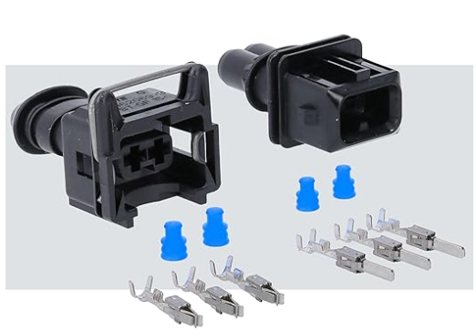 | Part number: TE 282189-1 and 106462-1 JPT 2-pin connectors https://www.amazon.co.uk/Sealed-Waterproof-Female-Connector-Prewired/dp/B0DPL3DRDV/ref=sr_1_6?sr=8-6                |
|                 | TT1110-P04 Fendt old-style ISOBUS/K-BUS etc connectors                                                                                                                                 |

### 3-pin

| Description                                | Sample                                                                                                                                                                                                                    |
| ------------------------------------------ | ------------------------------------------------------------------------------------------------------------------------------------------------------------------------------------------------------------------------- |
| 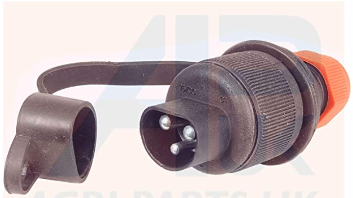        | Part Number: try "3 pin tractor plug" Typical usage: powering your boards! https://www.amazon.co.uk/APUK-Tractor-Implement-Compatible-Amazone/dp/B07MXNW193 https://fr.aliexpress.com/item/1005003772953929.html |
| 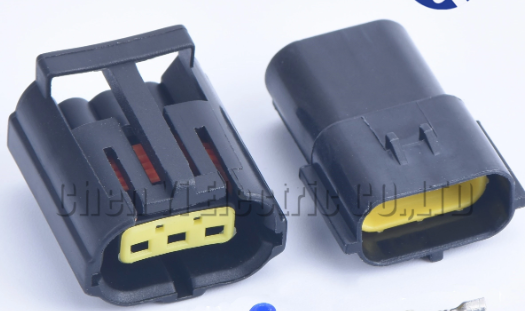 | Part Number: TE Connectivity 344273-1 Typical usage: Case/NH WAS https://www.aliexpress.com/item/10000352442786.html                                                                                                |

### 4-pin

| Description                          | Sample                                                                   |
| ------------------------------------ | ------------------------------------------------------------------------ |
| 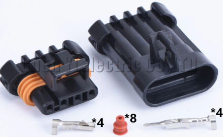 | For Danfoss valve https://www.aliexpress.com/item/10000360045685.html |
|  | For Case/NH WAS https://www.aliexpress.com/item/1005005231434626.html |

### 6-pin

| Description                                  | Sample                                                                                                                                                                                                                                               |
| -------------------------------------------- | ---------------------------------------------------------------------------------------------------------------------------------------------------------------------------------------------------------------------------------------------------- |
|  | Part Number: TE Connectivity 1-967241-1 Typical usage: Claas ATP 009 steering modules https://www.te.com/usa-en/product-1-967241-1.html Pins https://www.digikey.co.uk/en/products/detail/te-connectivity-amp-connectors/927770-1/2054472   |
|  | Part Number: TE Connectivity 1-954426-1 Typical usage: Claas ATP 009 steering modules https://www.te.com/usa-en/product-1-965426-1.html Pins https://www.digikey.co.uk/en/products/detail/te-connectivity-amp-connectors/1-963749-1/4021582 |

### 7-pin

| Description                     | Sample                                                                                                                                                                                                                                      |
| ------------------------------- | ------------------------------------------------------------------------------------------------------------------------------------------------------------------------------------------------------------------------------------------- |
| 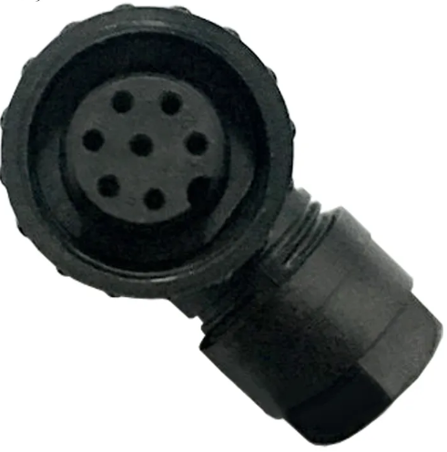 | Part Number: Amphenol CO16 Typical usage: 3pt-linkage sensor https://www.aliexpress.com/item/1005004315200768.html?gatewayAdapt=Msite2Pc See also: https://discourse.agopengps.com/t/massey-ferguson-7700-autosteer-ready/7001  |

### 8-pin

| Description                      | Sample                                                                                                             |
| -------------------------------- | ------------------------------------------------------------------------------------------------------------------ |
|  | Part Number: Deutsch DT06-8S Typical usage: Keya Gen4 motor https://www.te.com/en/product-DT06-08SA.html Male pins (if required) are: https://www.te.com/en/product-0460-264-16141.html (1.6mm diameter)|

### 9-pin

| Description                        | Sample                                                                                                                                                                                                                                                                                                     |
| ---------------------------------- | ---------------------------------------------------------------------------------------------------------------------------------------------------------------------------------------------------------------------------------------------------------------------------------------------------------- |
|        | Part number: search "J1939 plug" Typical usage: ISOBUS/CANBUS connectors https://mou.sr/3ogaikK https://www.agritronixcorp.com/amphenol-tuchel-c016-7-terminal-plug-male-kit.html https://www.aliexpress.com/item/1005002988396207.html https://www.te.com/usa-en/product-HD16-9-1939S.html |
|  | Part number: search "J1939 plug" Note, typically green plugs are for 500kbps sockets. Black for 250 or lower. There is a subtle pin difference to the above with regard to the diameter of the top pin. https://mou.sr/45feOk9 https://www.te.com/usa-en/product-HD16-9-1939S-P080.html           |
|        | Part Number: TE/AMP 206708-1 https://www.te.com/en/product-206708-1.html Typical usage: In-cab ISOBUS connectors                                                                                                                                                                                     |
|    | Part Number: AHDP06-24-91SN-WTA https://www.mouser.co.uk/ProductDetail/Amphenol-SINE-Systems/AHDP06-24-91SN-WTA?qs=MyNHzdoqoQLlEjSU%2Fu0c6Q%3D%3D Typical usage: Exterior ISOBUS connectors                                                                                                          |

### 12-pin

| Description                        | Sample                                                                                                                                                                                                                           |
| ---------------------------------- | -------------------------------------------------------------------------------------------------------------------------------------------------------------------------------------------------------------------------------- |
| 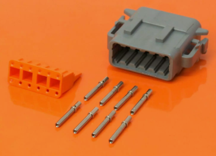       | Part number: Search Deutsch DTM06-12SA Pins: 0462-201-20141 Typical usage: Custom PCBs                                                                                                                                     |
| 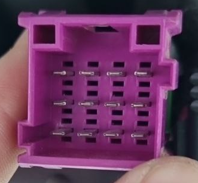 | Part number: Search TE 4-967627-1 Typical usage: Claas modem connector [https://www.te.com/usa-en/product-1-964449-1.html](https://www.te.com/en/product-4-967627-1.html) https://www.te.com/en/product-5-968972-1.html |

### 16-pin

| Description                         | Sample                                                                                                                                                                                                                                      |
| ----------------------------------- | ------------------------------------------------------------------------------------------------------------------------------------------------------------------------------------------------------------------------------------------- |
|  | Part number: Search 1-1964449-1 Typical usage: Claas ATP 009 steering modules https://www.te.com/usa-en/product-1-964449-1.html Style is similar to 6-pin above                                                                    |
|     | Part number: Search 206037-1 Typical usage: MF S-Series CANBUS diagnostic socket https://www.mouser.co.uk/ProductDetail/TE-Connectivity/206037-1?qs=mKNKSX85ZJf9q%2FMnuCzRZQ%3D%3D Pins https://www.te.com/en/product-66101-4.html |

### 19-pin

| Description                   | Sample                                                                                                                                                                                                                                                                                            |
| ----------------------------- | ------------------------------------------------------------------------------------------------------------------------------------------------------------------------------------------------------------------------------------------------------------------------------------------------- |
|  | Deutz Fahr CANBUS Cannon Trident Ringlock Part Number TR1619PFS1NB https://www.digikey.co.uk/en/products/detail/itt-cannon-llc/TR1619PFS1NB/2487190 Pins are T2P16MC1LT https://www.aliexpress.com/item/1005006200968123.html   https://www.aliexpress.com/item/1005004062210756.html |

### 23-pin

| Description                                 | Sample                                                                                                                                                                  |
| ------------------------------------------- | ----------------------------------------------------------------------------------------------------------------------------------------------------------------------- |
|           | Part Number Ampseal 776087-1 Typical usage: For AgO boards https://www.te.com/usa-en/product-776087-1.html https://www.aliexpress.com/item/10000383252937.html |
| 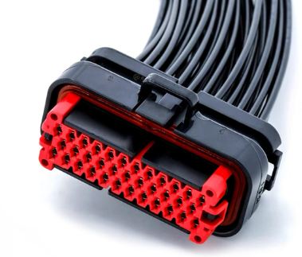 | Pre-wired plugs for same: https://www.aliexpress.com/item/1005002638698250.html https://www.aliexpress.com/item/10000383252937.html                               |

### 25-pin

| Description                      | Sample                                                                                                                                                                    |
| -------------------------------- | ------------------------------------------------------------------------------------------------------------------------------------------------------------------------- |
| 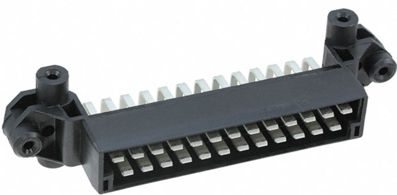 | Part Number: 827050-1 Typical usage: Lexion "gun-cabinet" A9 connector https://uk.farnell.com/amp-te-connectivity/827050-1/automotive-conn-r-a-hdr-25pos/dp/3394413 |

### 40-pin

| Description                  | Sample                                                                                                                                                                                                                                                                                        |
| ---------------------------- | --------------------------------------------------------------------------------------------------------------------------------------------------------------------------------------------------------------------------------------------------------------------------------------------- |
|  | Part Number: DRC22-40PB Typical usage - Case/NH Trimble Nav Controller https://www.te.com/usa-en/product-DRC22-40PB.html Or, print your own [here](https://discourse.agopengps.com/t/case-ih-puma-230-autosteer-ready/5592/72). These take TE Connectivity size 20 (1mm) contacts |

### Random pins and sockets

[1mm crimp](https://www.digikey.co.uk/en/products/detail/amphenol-sine-systems-corp/AT60-202-20141/5227529)

## Connector accessories

Below are 3d printable connector accessories. Use at your own risk.

https://www.thingiverse.com/thing:4670391 - 3-pin superseal backshell

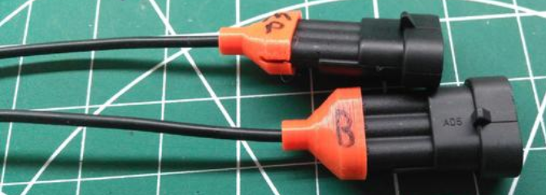

---

https://www.thingiverse.com/thing:2135524 - cap for 2-pin ampseal/superseal

---

https://discourse.agopengps.com/t/case-ih-puma-230-autosteer-ready/5592/73

40-pin DRC connector

---

Various SuperSeals you can print out:
https://cad.onshape.com/documents/337a36e88011d4509228a1b3/w/b5ec0133bb1899b23d31672b/e/46bc86a9c34d6419d811949c?renderMode=0&uiState=6468ebfb9c20896398f33cc8
