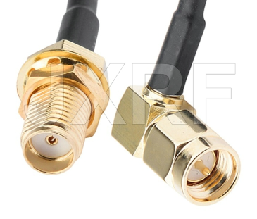

+++
title = "AIO other pieces"
linkTitle = "Other pieces to be able to assemble"
weight = 1
+++

So you've ordered your AIO board but want to fully assemble it.

The main pieces will likely be:

- [Teensy 4.1 a.k.a the brain of the board](/hardware/Other-components/teensy-4.1)
- [IMU for roll compensation](/hardware/Other-components/imu-inertial-measurement-unit)
- [GNSS / GPS - ZED-F9P](/hardware/Other-components/gps-modules-standard-or-micro)
- [Cytron MD13S driver](/hardware/Other-components/cytron-motor-driver)

You'll likely also need:

- some standard 2.54mm header pins between the components and the board e.g.:
  [aliexpress](https://www.aliexpress.com/item/4001201576815.html) or
  [botland](https://botland.store/connectors-goldpin/20031-straight-goldpin-1x40-connector-with-254mm-pitch-black-10pcs-justpi-5904422329198.html)
- A few (2-4 per board) jumpers e.g.:
  [aliexpress](https://www.aliexpress.com/item/1005001728290299.html) or
  [botland](https://botland.store/jumpers/2076-long-jumper-10pcs-5904422373313.html)
- Teensy requires 2x3 header that's size 2mm:
  [digikey](https://www.digikey.fr/fr/products/detail/te-connectivity-amp-connectors/2314820-6/10494751)
  or
  [botland](https://botland.store/connectors-goldpin/18241-female-socket-2x3-raster-2mm-straight-5pcs-5904422370695.html)
- Between Teensy and the Board you need the 2x3 connector:
  [digikey](https://www.digikey.fr/fr/products/detail/gct/BF050-06-A-B-0400-0300-L-G/16396911)
- Ampseal 23 board connector:
  https://www.aliexpress.com/item/10000383252937.html
- Standard GPS module requires a 30cm extender as well:
  https://www.aliexpress.com/item/1005003193091912.html (No 13. 30cm at the time
  of writing but compare it to the picture.)

- A crimping tool (for example a Yato YT-2255)
- A PCB enclosure: One option is to 3D print, with some ideas provided in the
  [3d prints section](/hardware/3dprints). You can also use standard electrical
  boxes or Hammond enclosures.

All of this should be enough to complete the board part of your build!
