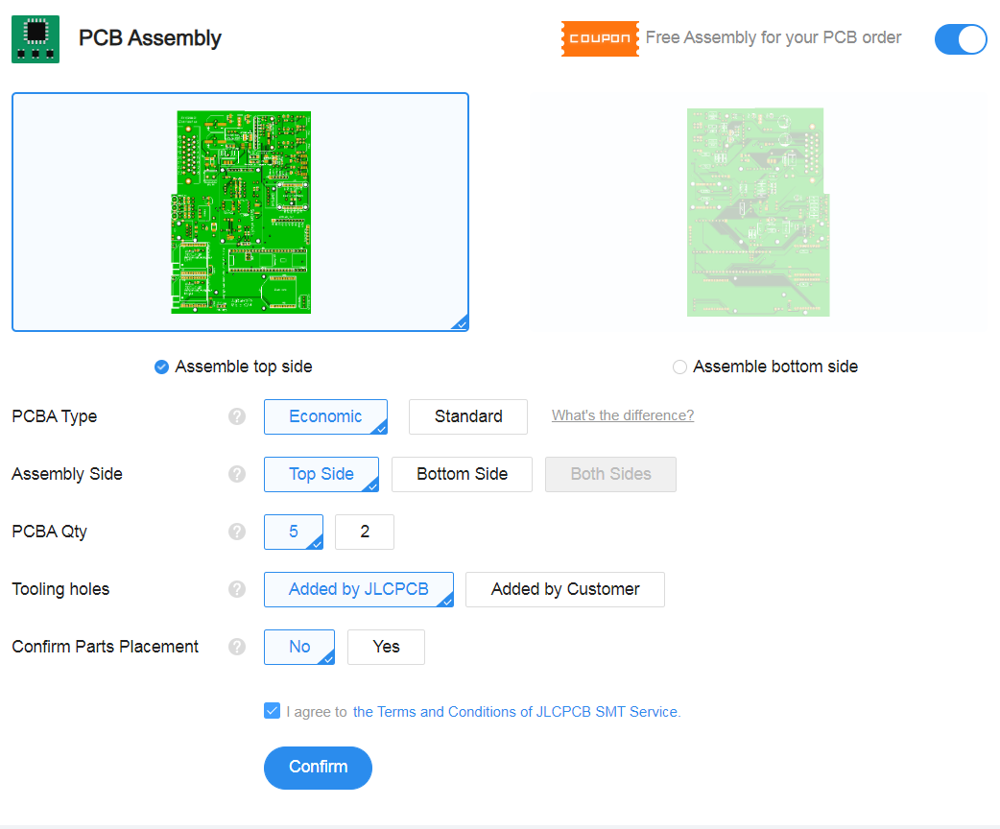
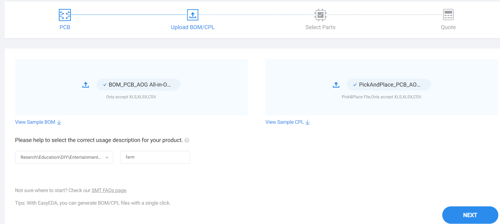
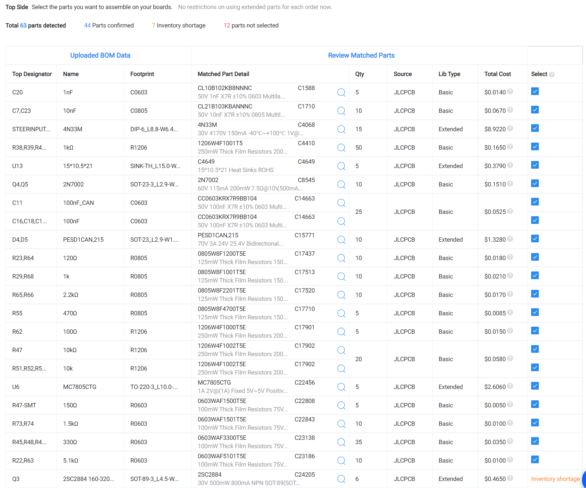
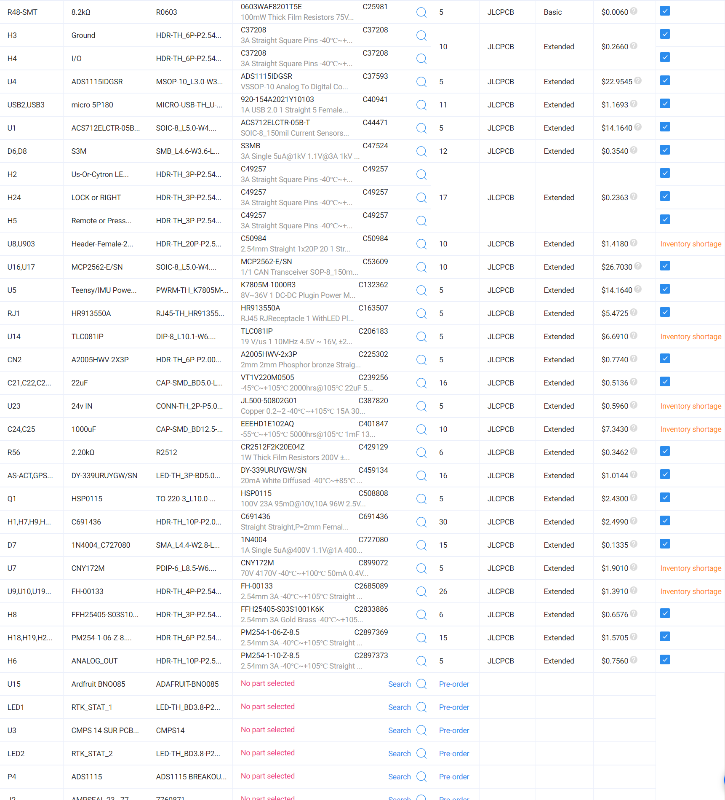
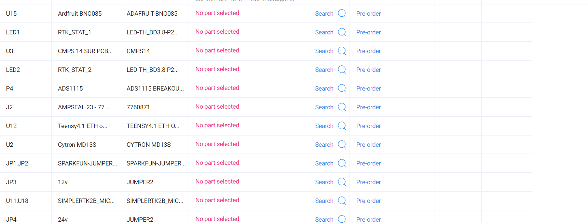
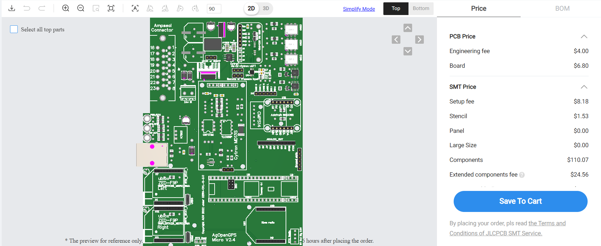

AgOpenGPS boards come in two flavours - Standard or Micro. Functionally, they are the same - they only differ in size. Whether you want single-GPS or dual, either board is fine; and you can simply add another GPS module at a later date if you so wish, no need for another board.

## Choose a board
V4.x is essentially the same board as v2.5x just improved.
V4 has stronger traces more LED-s for easier debugging and should be more bulletproof.

You can get the board designs from [here](https://github.com/AgHardware/Boards/tree/main/TeensyModules)
And you can find the discourse threads here:
* V2.x: https://discourse.agopengps.com/t/all-in-one-pcb/10444
* v4 micro: https://discourse.agopengps.com/t/v4-all-in-one-pcb/12313

## HOW TO ORDER/BUILD A PCB
We use the JCLPCB service to manufacture our PCBs, but you can use another supplier if you prefer.

### How to order Video

### How to order Text guide 

1.- Click on [Order Now ](https://cart.jlcpcb.com/quote)to access the page to place the order, and that'll take you to a page that looks like this:

**Caution: notice that the blank page is offering a 2-layer board, but on uploading the gerber file, it should detect is as 4-layer!**

These files are located in AgOpenGPS/Support/TeensyModules/Board and pick either your Micro or Std design. Inside each folder we will find three files that we are going to use, the ZIP file is your Gerber file, so pick that first:

It'll process for a bit, and you'll see a summary view:

Down to the bottom of the page, and slide the "PCB Assembly" switch over.

Here, you should select "assemble top side", and other important things are PCBA quantity, you can choose 5 full PCB (with SMD components soldered) or only 2 full PCB and 3 empty. If you choose Confirm Parts placement an JCLPCB engineer will correct your part placement and polarity (this action will need your confirmation).

!! Bottom side is for manual Assembly. If you choose to assemble both side you'll end up with a non-working board that has components twice. !!

Click Confirm when you're happy, and then add the BOM file and CPL file (they are in the same folder as the ZIP file - make sure you didn't accidentally move from the Standard to the Micro folder, or vice-versa!)

Now comes the fun part - it'll go and check with the JLCPCB inventory and see if any parts you need are missing. Here's a sample, it's likely yours will be different tho.

First off, starting from the bottom - it's expected that they can't supply some of the components. The SimpleRTK2B, the Cytron, the Teensy, various connectors etc, the BNO085 - they're all fine to omit and you can get them elsewhere. If you can find alternatives, now would be a good time to try that, but if not, just Save to Cart again and get the cool 3D rendered output.

### Shortfall / Alternate parts

As above, you'll find that some components are likely not in stock. Here are some suitable alternatives:

Name | Designator | Footprint | Quantity | Supplier | Supplier Part | Alternatives
-- | -- | -- | -- | -- | -- | --
1000uF | C24,C25 | CAP-SMD_BD12.5-L13.0-W13.0-FD | 2 | LCSC | C401847 | C2904877
1N4004_C727080 | D7 | SMA_L4.4-W2.8-LS5.4-RD | 1 | LCSC | C727080 | C433394
FH-00133 | U10,U19,U9,U11,U18,U902,U904,U905,U906,U907,U908,U909,U910 | HDR-TH_4P-P2.54-V-F | 13 | LCSC | C2685089 | C2935975,C2897367
A2005HWV-2X3P | CN2 | HDR-TH_6P-P2.00-V-F-R2-C3-S2.00 | 1 | LCSC | C225302 | C2935888,C2906071
1510.521 | U13 | SINK-TH_L15.0-W10.5-H21.0 | 1 | LCSC | C4649 | C116600
24v IN | U23 | CONN-TH_2P-P5.08_JL500-50802G01 | 1 | LCSC | C387820 | C709041
Header-Female-2.54_1x20 | U8,U903 | HDR-TH_20P-P2.54-V-F | 2 | LCSC | C50984 | C2905423
