# Configuring the Teensy

## Uploading the code (the hopefully-easiest way!)

Go [here](https://github.com/lansalot/AOGConfigOMatic/releases) and check out this AOG Teensy flashing tool, that will provide the firmware and everything for you. All you should have to do is click two buttons. It provides a simple way to pick and choose firmwares for you, and could save you having to look through folders for the correct one for your use case.

It will also configure the ublox F9P for you, so give it a try!

***

## Uploading the code (the next-easiest way)

Download the hex file (this is the compiled software) and the program to load it to the Teensy, from the repository:
https://github.com/AgHardware/Boards/tree/main/TeensyModules/AIO%20Micro%20v4/Firmware

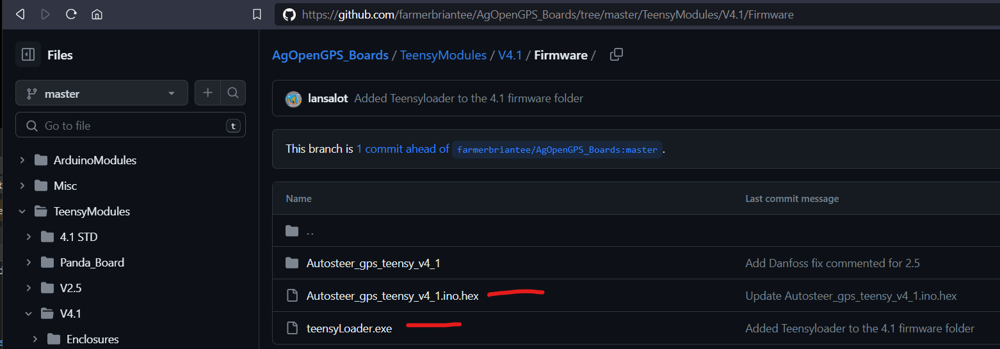

Run the TeensyLoader app:

and then select File, Open Hex, and open the hex file you downloaded.

Now would be a great time to plug the Teensy in - if this is the first time this Teensy has been connected, it might well install some drivers, so give it a moment to settle. When all is calm, press the green button to flash it. You might have to press the white button on the Teensy too if nothing happens, to allow the Teensy to pull the image down (generally, you only have to do this the first time you flash it tho).

Takes just a moment, then you're done!

***

### But, some people like a challenge, so here's the hard way - and before you go any further, don't plug the Teensy in just yet!

[Retrieve the code](https://github.com/AgOpenGPS-Official/Boards/archive/refs/heads/main.zip) and unzip it.

### NOTE: it may be version 5.5, 5.7, 5.7.1 whatever is in the support folder. Go with the latest that's there!

You will need:
* [Arduino IDE 1.8.x](https://www.arduino.cc/en/software) (legacy version). Version 2 has some issues occasionally, so don't use that
* [TeensyDuino](https://www.pjrc.com/teensy/td_157/TeensyduinoInstall.exe) - use 1.5.7, this is known to work. Newer versions will cause the Teensy to constantly reboot once flashed, that's no use.

Your downloads folder will likely look something like this:

And while you're at it, right-click on the ZIP file with the code from Github, and do Extract All. Accept the default locations.

Grab the Arduino IDE from the link above and install it. Accept all the default during the installation. If you get asked to install device software or other drivers, agree:

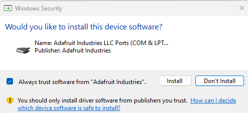

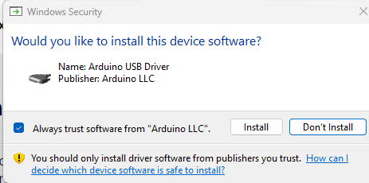

Once that's done, install TeensyDuino.

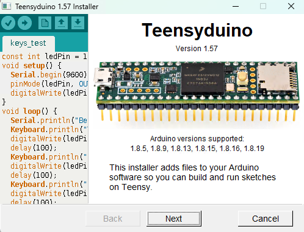

It should find your Arduino IDE (you did accept the defaults, didn't you?) so accept that:

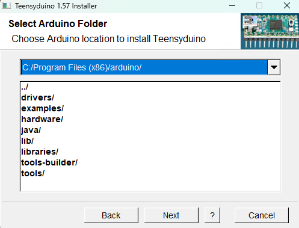

Who likes a good library? You do! Install them!

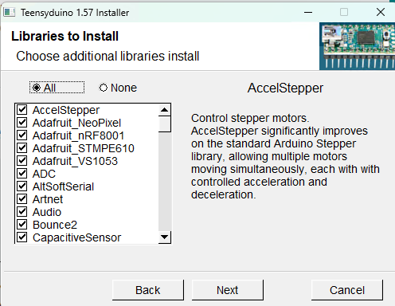

And when it's done, you'll see something like this:

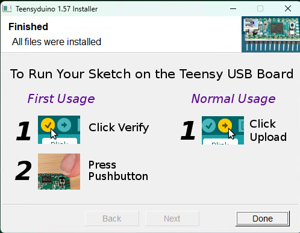

You can plug your Teensy in now over USB - and make sure it is removed from the Panda or All-in-one-boards!!

Now would be a great time to make sure the drivers are OK. Right-click on your Start menu (or long-press the start menu if you're on a touch-screen), and pick Device Manager.

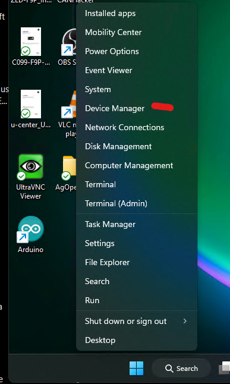

Find the Ports (COM & LPT) section, and open it. Your Teensy should be there, without any red crosses or exclamation marks beside it. Note that your port number, in this case COM3, will likely be different. Remember that number, it's important. Also, to aid in identification, make sure you don't have any other devices plugged in that might be assigning COM ports (eg, your ZED-F9P modules):

Then, you're going to load the software to your Teensy. Start the Arduino IDE. If you see any messages like this, select "Allow Access":

It'll come up with an empty "sketch", but we don't care about that. File, Open and find your way down into the files you extracted:

Once you've found that folder, pick the file shown (it will be named the same as the folder - and the version might well be different if a new one is released and this wiki page hasn't been updated):

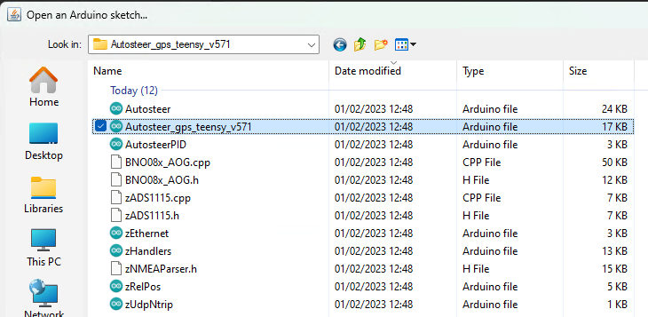

Another instance of the Arduino IDE will open (you can close the empty one), and now we're just about ready to send it to the Teensy. However, despite having the IDE and TeensyDuino installed, the Arduino software doesn't actually exactly what model of Teensy you have (it might have guessed it right, it might not), so we need to check some items on the Tools menu. The first to pick is the board, so go make sure 4.1 is picked.

You might notice when you return to the Tools menu, that there are more options on there now that weren't there before. Don't worry about that.

We can lower the speed to 450mhz which will keep the chip a little cooler with no ill effect:

There will likely be a choice for the Port, so make sure you've the one that says Teensy 4.1 picked and ticked:

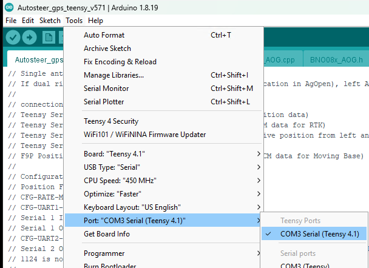

Now the exciting part - you're a software developer for the next few minutes. Click the second icon on the toolbar, the Right-arrow, and all being well, it should compile it and send it to the Teensy! Depending how decent your computer is, this may take anything from a couple of seconds to a couple of minutes. Watch the green progress bar down the bottom:

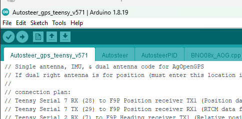

You might notice a couple of warnings - ignore those. Red text means something has gone wrong tho, in which case paste a screenshot or the text in Discourse/Telegram and ask for help.

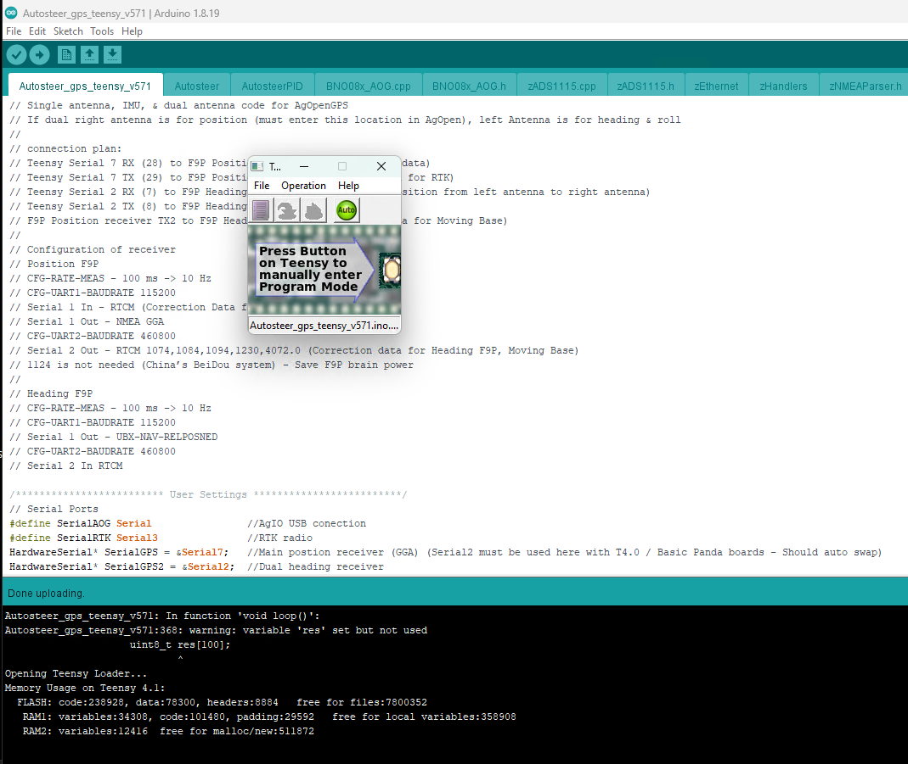

The Teensy flasher (ahem) might pop up and ask you to press a button the Teensy - that's the big white button if so - but it might well just crack on and flash it for you. Watch for the flashing red lights on the Teensy. And then when it's finished... nothing. Silence. Just that screen, and no lights on the Teensy (the reason it was likely flashing when you plugged it in for the first time is it was running what's known as the "blink sketch" - code that does nothing more than flash the little LED).

So, how do we know it's working? We go to the monitor!

It's likely saying something like this:

And congratulations - your Teensy is now running the AgIO code! You can put it back in either the Panda board, or your all-in-one board now!

(Sorry tho, that's possibly your software developing days over)

## Problems

I got weird red message in text! Help!

First thing to do is CHECK YOUR MODEL! If it's not set to Teensy 4.1, it won't work. And every wrong model will likely throw you a different message. Go back above and set it properly.

***

## I flashed it according to instructions, but it keeps making the USB disconnect noise and rebooting?

Yeah, TeensyDuino versions other than 1.57 will cause that. Use the easy method above to skip all that grief, or make sure you are using the correct versions as described in the instructions.