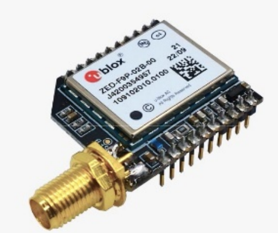

## What is it, GNSS or GPS.. 
Well, GNSS stands for Global Navigation Satellite System. It's the Collective name for multi GNSS Satellites like GPS, Glonass, Galileo, Beidou and QZSS. Mostly everyone calls his system a GPS Autosteer System but GPS is the American Satellite system. That's where the confusion often comes from.

The systems work with NMEA strings (data that came from GNSS receivers with actual position, ground speed, heading, and so on.) So, to know where your tractor is you need one. Most used currently are [Ardusimple's SimpleRTK2B](https://www.ardusimple.com/simplertk2b/) F9P receiver boards. They are very good and low priced multi GNSS receivers and also RTK ready. For a good auto steer system you need very high accuracy. with rtk corrections fed into the SimpleRTK2b board it can get to a <2cm precision. I tell more about that in the NTRIP/RTK page.

## F9P modules - standard or micro?

Here, you'll be following your board choice - you can't fit Micro GPS modules to a standard board, or vice versa.

Standard: [https://www.ardusimple.com/product/simplertk2b/](https://www.ardusimple.com/product/simplertk2b/)

Standard with Antenna [https://www.ardusimple.com/product/simplertk2b-basic-starter-kit-ip65/](https://www.ardusimple.com/product/simplertk2b-basic-starter-kit-ip65/)

or Micro: [https://www.ardusimple.com/product/simplertk2b-micro/](https://www.ardusimple.com/product/simplertk2b-micro/)

Options :\
Variant - ZED-F9P (absolutely NOT F9R!!)\
RF connector - SMA\
Form Factor- Through hole

If you want to use it standalone or with an rtkbase, here's a breakout board - then USB should recognize it: https://github.com/AgHardware/Boards/tree/main/Ublox%20F9P/BuckWheat%20Micro%20breakout

## XBee module pinout

If you match up the angled corners then the pinout matches, XBEE calls the communication pins DOUT/DIN instead of TX/RX. The only connections that the USB adapter makes is power, ground, DIN, DOUT, and RSSI (the led will just be off). Install with the RF connector away from the USB connector.

Note that the ArduSimple adapter doesn’t use the micro F9P’s USB connection, it uses the micro F9P’s serial connection through an FTDI converter. If you are going to use RTKBase for the base station then the micro F9P won’t be automatically recognized. You’ll want to jump to step 7 of the RTKBase Github install page “Connect your gnss receiver to raspberry pi/orange pi/… with usb or uart, and check which com port it uses (ttyS1, ttyAMA0, something else…)” Just a couple extra setup steps, not that time consuming.

## Single or Dual
Dual has built-in heading and roll calculation. Antennas must be placed at least 150cm apart. The performance of single have been greatly improved it worth trying before going with dual.

