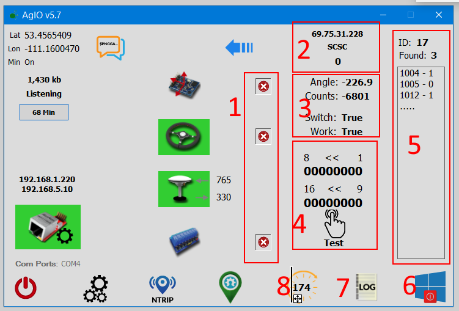
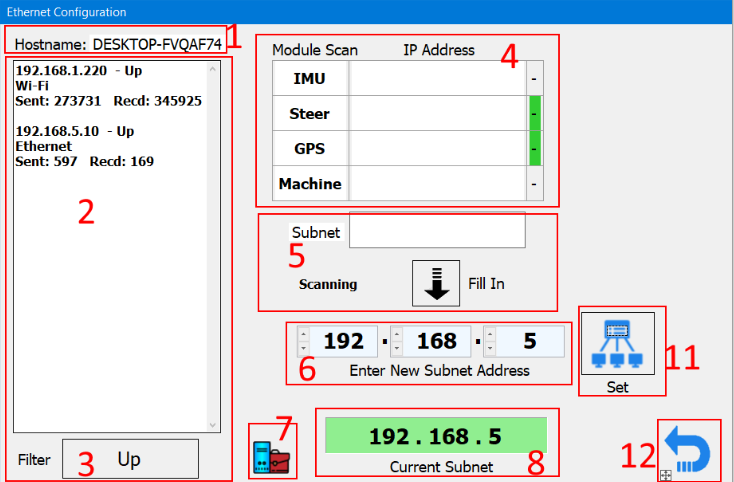
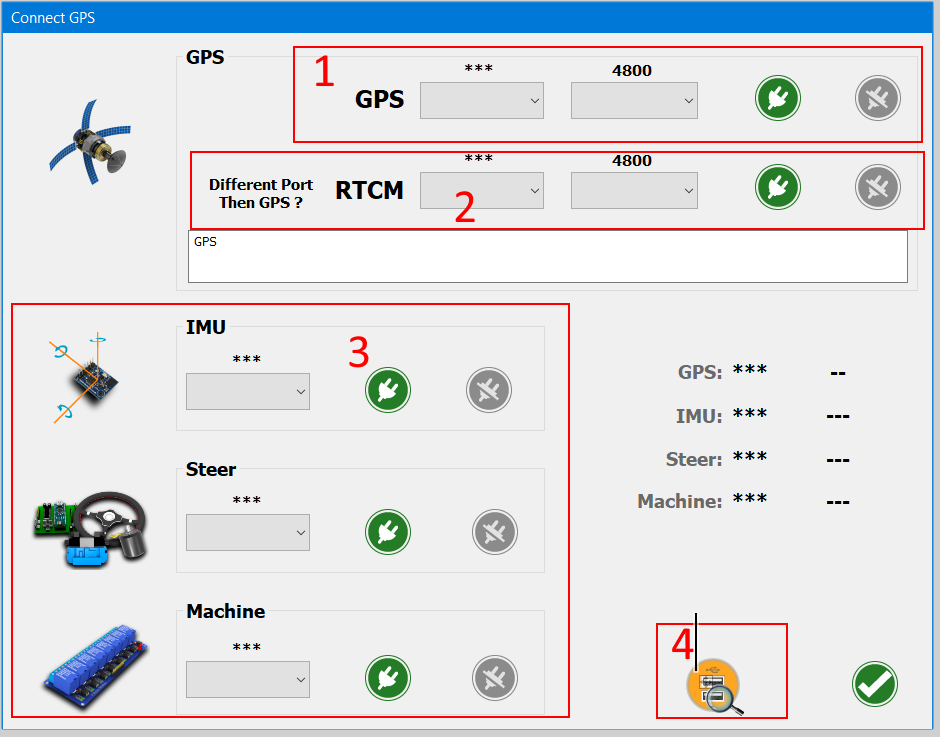
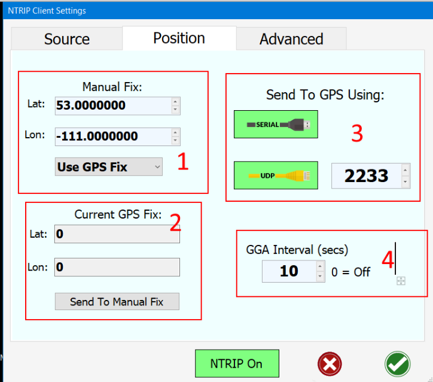
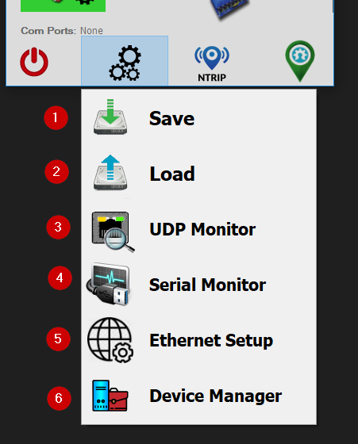
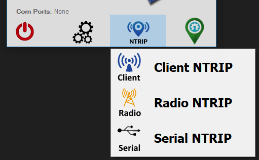

## Normal Display

1. RTK information area

2. UDP networking area. Touch the icon to set up networking. If button is not green, a dialog will allow you to turn on UDP. Just touch the UDP button and hit ok. If you are and only if you are using Linux here is where you can change the loopback address. Here is a picture of the dialog that comes up.

3. Modules and Status. For each icon, touch and it brings up a dialog to connect to serial ports. When the icon is green it is communicating normally. If neither green or red, it has not been connected this session. If it is red, it was formerly talking, but has lost communication. 
The little numbers beside GPS show data bytes from and to the antenna.

4. Flyout button to see the full display of AgIO (explained below)

5. Position information. Touch the icon for a dialog showing all the NMEA information.

At the bottom is the menu, the icon at the far right starts AgOpenGPS.

## Full Display

1. Show/Hide individual modules. If not using the particular module, touch X and hide it. Touch + to bring it back.

2. RTK caster IP address and Mount. Also is packet bytes being sent.

3. Information from steer module. shows the angle and the raw counts from the a/d convertor. Shows the action of the switch - it should change as you click the switches. Be patient, it only updates 1 time per second.

4. Shows what the machine module is receiving for section on-off. If these don't change to 1 as sections turn on there is a problem.

5. RTK parsing. This works ok but don't rely on it if a particular sentence isn't showing up. RTK is very complex and this shows a rough estimation of the station ID and sentences found, as well as how many per 10 seconds.

6. Touch this icon to shut down Windows and the computer power.

7. Creates a log of incoming sentences. The log is created in the main AgOpenGPS folder. 

8. Normally this extended view of AgIO is open for 3 minutes, then it shrinks to the small view, then after 3 minutes, minimizes to the taskbar. You can reset the 3 minutes by touching this icon.

You can hide the full display by touching the blue arrow again, or just minimize to tray at the top. 

## Ethernet (UDP) Setup Dialog

1. Hostname is the name given to your computer for networking. It must be unique on the network.

2. List of all the network adapters (NIC) (network card) (bunch of different names) in your computer. It shows the IP address of the adapter, the name/type, and updates the packets sent and received through it.

3. You can filter out the adapters that are connected and talking, or all the adapters no matter the status of the connection.

4. Assuming you have modules connected and working they will show up here. It lists the IP address for each module if connected as well as the connection status on the far right. This is the same green as on the main display showing it is connected. Not green or red means it never connected in the first place.

5. Subnet. This is the subnet of the network adapter that sent a message to all the modules connected. This will be the main subnet for AgIO, each module, and the network adapter. Everything must be on the same subnet or it will not work. Touch the "fill in" button to automatically fill in #6. You don't have to, but is convenient.

6. This is where you can manually enter and send a new subnet. 

7. This brings up the Windows Network Management App from Control Panel.

8. This is the current subnet set in AgIO.

9.
10.

11. Set Subnet. This button sets the subnet address for AgIO and sends it also to the modules. After doing so, the indicators in the scanning box should go green.  

12. Return back to main AgIO display.

## Serial Connections

1. Select the serial com port, the correct baud rate, and touch the green connect button to connect to a serial GPS unit.

2. If using RTK via a serial or USB port, connect here

3. Module connections are done here. Plug in one at a time so you know which is which, then connect.

4. If you have connected and additional USP Com Port, touch here to add it to the list of choices when connecting.

## RTK

1. Turn on or off NTRIP.

2. This is your computer name along with all active networks.

3. Enter either the IP or URL name of your caster website

4. Touch verify to make sure it is a real and accessible site. The IP will be displayed. Sometimes they change.

5. Enter your Caster Username and Password here

6. Touching Get Source Table will bring up alist of all the available mounts for that caster. Your job to pick the right one.

7. This is the port the caster will send on, usually 2101 is correct and is the default.

1. Enter the current fix manually. Also select manual or just to use GPS Fix

2. Use the current GPS Fix to fill in the Manual Fix entry. Saves a lot of typing.

3. How are you sending RTK? Select serial or UDP and the port to send to. If using one but not the other, turn off the one you are not using. (most often is the case).

4. GGA Interval is how often a GGA sentence gets sent back to the caster. More often uses more data. And set to 0 if you want it off completely to not send at all.

## Menus

1. Save Profile - Save all the settings in AgIO including RTK settings.

2. Load Profile - means to load an existing previously saved.

3. UDP Monitor - Allows you to view UDP packets leaving and coming into AgIO. PGN's, NTRIP, as well as nmea strings.

4. Serial Monitor - Connect to any serial port and monitor its activity. Very useful to connect to a module that is running on UDP. 

5. Ethernet Setup - Brings up the dialog to turn on - off udp. Only change the loopback address if using Linux or know exactly why it would ever be changed. Any other loopback settings for Windows do not work. 

6. Device Manager - Runs the Applet from Windows Control panel of all the devices hardware.

1. NTRIP from the internet - all the settings associated like caster address, mount, user and password etc.

2. NTRIP via Radio - Brings up a dialog to configure special RTK radio systems.

3. NTRIP via Serial - Dialog for RTK via serial input like from a phone USB, or external radio with serial output.

